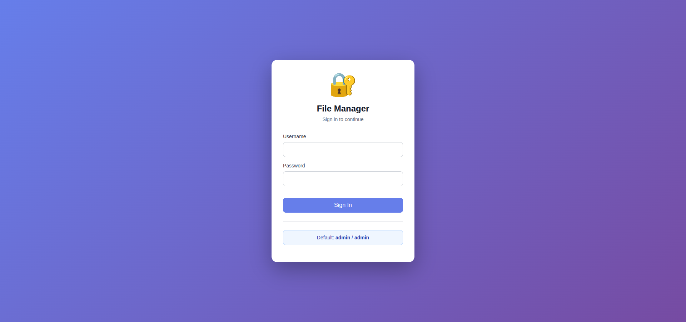
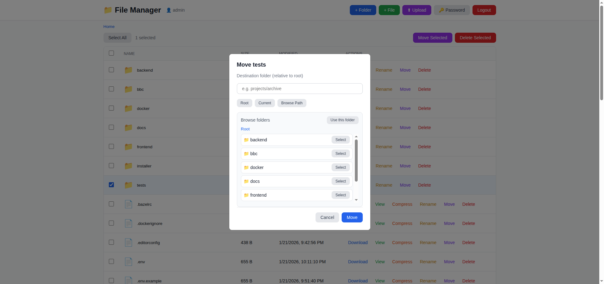
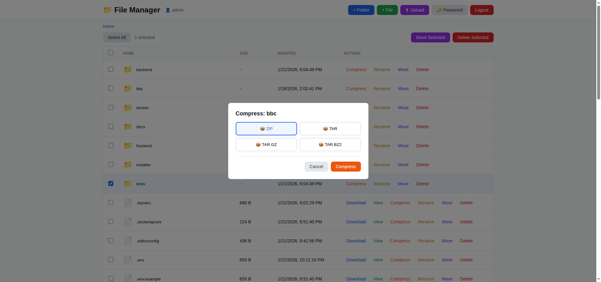

# 📁 Single PHP File Manager

[](https://opensource.org/licenses/MIT)
[](https://www.php.net/)
[](https://github.com/Al-Waleed-IT/single-php-file-manager/actions)
[](https://github.com/Al-Waleed-IT/single-php-file-manager/releases/latest)
[](https://github.com/Al-Waleed-IT/single-php-file-manager/releases)

A powerful, modular PHP file manager that builds into a single 209KB file. Features authentication, file operations, and archive management with a modern Vue 3 interface.

## ✨ Features

- 📦 **Single File Distribution** - One PHP file, no dependencies
- 🔐 **Secure Authentication** - BCrypt password hashing (12 rounds)
- 📂 **Complete File Management** - Create, rename, delete, upload, download, edit
- 🗜️ **Archive Support** - Create ZIP, TAR, TAR.GZ, TAR.BZ2 + extract ZIP, TAR, GZ, BZ2, XZ
- 🧭 **Move Browser** - Pick destinations with a built-in folder picker
- ✅ **Bulk Actions** - Select multiple items and move/delete in one action
- 🔑 **Password Manager** - Change credentials from the UI
- 🎨 **Modern UI** - Vue 3 reactive interface with responsive design
- 🚀 **Fast** - Lightweight and optimized for performance
- 🔧 **PHP 5.6+ Compatible** - Works on legacy and modern PHP versions
- 📝 **Modular Development** - Clean, maintainable source code
- 🛠️ **Node.js Build System** - Modern development workflow
- 🌐 **No External CDNs** - All assets embedded

## 📥 Quick Start

### Download Pre-built File

1. Download the latest `filemanager.php` from [Releases](https://github.com/Al-Waleed-IT/single-php-file-manager/releases/latest)
2. Upload to your server
3. Access via browser: `https://yoursite.com/filemanager.php`
4. Login with default credentials:
   - **Username**: `admin`
   - **Password**: `admin`
5. **⚠️ Change password immediately!**

### Build from Source

```bash
# Clone repository
git clone https://github.com/Al-Waleed-IT/single-php-file-manager.git
cd single-php-file-manager

# Download Vue 3 (if not present)
curl -sL https://unpkg.com/vue@3/dist/vue.global.prod.js -o src/js/vue.prod.js

# Build
npm run build

# Output: dist/filemanager.php
```

## 🎯 Usage

### Development Mode

```bash
# Watch for changes and auto-rebuild
npm run dev

# Start PHP development server
./start-dev.sh
# Access at http://localhost:8000
```

### Production Build

```bash
npm run build
```

The built file will be in `dist/filemanager.php`

## 📸 Screenshots

### Login Screen


### File Manager Interface


### Move Files/Folders


### Compress Files/Folders


## 🏗️ Project Structure

```
single-php-file-manager/
├── src/                    # Source files (modular)
│   ├── php/               # Backend modules
│   │   ├── config.php     # Configuration
│   │   ├── auth.php       # Authentication
│   │   ├── filesystem.php # File operations
│   │   ├── archive.php    # Archive handling
│   │   └── api.php        # API routing
│   ├── js/
│   │   ├── vue.prod.js    # Vue 3 (embedded)
│   │   └── app.js         # Application logic
│   ├── css/
│   │   ├── base.css       # Base styles
│   │   └── components.css # UI components
│   └── templates/
│       ├── login.html     # Login template
│       └── main.html      # Main interface
├── build.js               # Build script
├── dist/
│   └── filemanager.php    # Single file output (209KB)
└── package.json
```

## 🔧 Configuration

Edit `src/php/config.php` before building:

```php
define('BASE_DIR', __DIR__);                      // Working directory
define('MAX_UPLOAD_SIZE', 100 * 1024 * 1024);    // 100MB
define('USERS_FILE', __DIR__ . '/.users.json');  // User storage
define('BCRYPT_COST', 12);                       // BCrypt rounds
```

## 🛡️ Security Features

- ✅ BCrypt password hashing (12 rounds, configurable)
- ✅ Session-based authentication
- ✅ Directory traversal protection
- ✅ File upload size limits
- ✅ Hidden system files (.users.json)
- ✅ CSRF protection via session validation
- ✅ Input sanitization

## 🔑 Default Credentials

**⚠️ IMPORTANT:** Change these immediately after first login!

- **Username**: `admin`
- **Password**: `admin`

## 📦 Archive Support

### Create Archives
- ZIP
- TAR
- TAR.GZ (gzip compressed)
- TAR.BZ2 (bzip2 compressed)

### Extract Archives
- ZIP
- TAR
- GZ (gzip)
- BZ2 (bzip2)
- XZ

## 🚀 Features in Detail

### File Operations
- ✅ Upload multiple files
- ✅ Download files
- ✅ Create files and folders
- ✅ Rename items
- ✅ Move files and folders (single or bulk)
- ✅ Delete files and directories
- ✅ View and edit text files (up to 1MB)
- ✅ Breadcrumb navigation
- ✅ Multi-select with bulk actions

### Archive Operations
- ✅ Compress files/folders to multiple formats
- ✅ Auto-detect and extract archives
- ✅ Smart naming (avoids overwriting)
- ✅ Recursive directory compression

### User Interface
- ✅ Responsive design (mobile-friendly)
- ✅ Modal dialogs for operations
- ✅ Folder picker for move destination
- ✅ Change password modal
- ✅ Real-time notifications
- ✅ Loading states
- ✅ Keyboard shortcuts (Enter to submit)
- ✅ File type icons

## 🔄 Development Workflow

1. **Edit source files** in `src/` directory
2. **Build**: `npm run build`
3. **Test**: `./start-dev.sh`
4. **Deploy**: Upload `dist/filemanager.php`

### Adding Features

See [CONTRIBUTING.md](CONTRIBUTING.md) for detailed examples of adding new features.

## 📋 Requirements

### Production
- PHP 5.6 or higher
- PHP extensions: `zip`, `phar` (for archive operations)

### Development
- Node.js (any recent version)
- npm or yarn

## 🐛 Troubleshooting

### Build Issues
```bash
# Ensure Node.js is installed
node --version

# Rebuild from scratch
npm run clean
npm run build
```

### PHP Syntax Errors
```bash
# Check PHP syntax
php -l dist/filemanager.php

# Check PHP version
php -v
```

### Archive Operations Fail
```bash
# Check PHP extensions
php -m | grep -E 'zip|phar'

# Install missing extensions (Ubuntu/Debian)
sudo apt-get install php-zip
```

### Permission Errors
```bash
# Set correct permissions
chmod 755 /path/to/directory
chmod 644 dist/filemanager.php
```

## 🤝 Contributing

Contributions are welcome! Please see [CONTRIBUTING.md](CONTRIBUTING.md) for guidelines.

1. Fork the repository
2. Create your feature branch (`git checkout -b feature/amazing-feature`)
3. Commit your changes (`git commit -m 'Add amazing feature'`)
4. Push to the branch (`git push origin feature/amazing-feature`)
5. Open a Pull Request

## 📊 Statistics

- **Lines of Code**: ~1,300
- **Source Files**: 16
- **Built Size**: 209KB
- **Build Time**: <1 second

## 🔍 API Reference

All endpoints use POST method (except `download`):

| Endpoint | Description | Parameters |
|----------|-------------|------------|
| `?action=login` | Authenticate user | username, password |
| `?action=logout` | End session | - |
| `?action=list` | Get directory contents | path |
| `?action=upload` | Upload file | path, file |
| `?action=delete` | Delete item | path |
| `?action=rename` | Rename item | oldPath, newName |
| `?action=create` | Create file/folder | path, name, type |
| `?action=read` | Read file content | path |
| `?action=write` | Write file content | path, content |
| `?action=download` | Download file (GET) | path |
| `?action=compress` | Create archive | path, format |
| `?action=extract` | Extract archive | path |
| `?action=change_password` | Update password | currentPassword, newPassword |

### Response Format
```json
{
  "success": true,
  "message": "Success message",
  "data": {}
}
```

## 📜 Changelog

See [CHANGELOG.md](CHANGELOG.md) for version history.

## 📄 License

MIT License - see [LICENSE](LICENSE) file for details.

## 🌟 Star History

[](https://star-history.com/#Al-Waleed-IT/single-php-file-manager&Date)

## 🙏 Acknowledgments

- [Vue.js](https://vuejs.org/) - Progressive JavaScript framework
- [PHP](https://www.php.net/) - Server-side scripting language
- All contributors and users!

## 📞 Support

- 🐛 [Report Bug](https://github.com/Al-Waleed-IT/single-php-file-manager/issues)
- 💡 [Request Feature](https://github.com/Al-Waleed-IT/single-php-file-manager/issues)
- 💬 [Discussions](https://github.com/Al-Waleed-IT/single-php-file-manager/discussions)

## 📈 Project Status

This project is actively maintained. Feel free to open issues or submit pull requests!

---

Made with ❤️ by [Al-Waleed-IT](https://github.com/Al-Waleed-IT)
